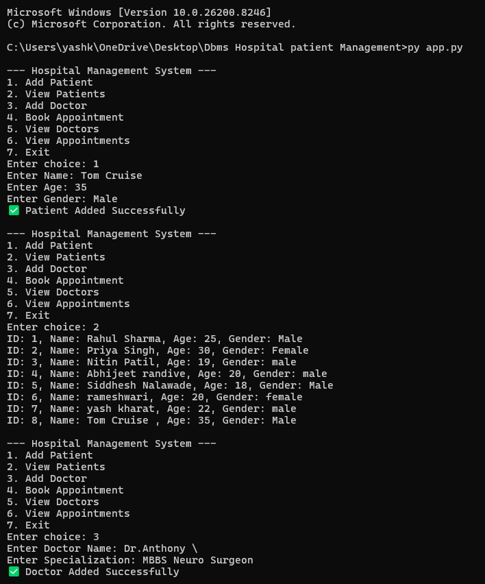
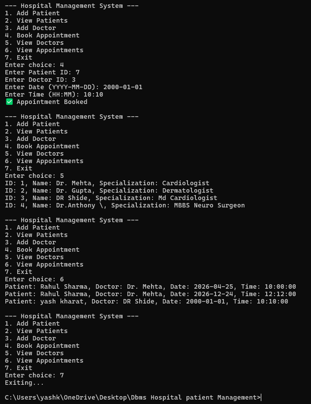
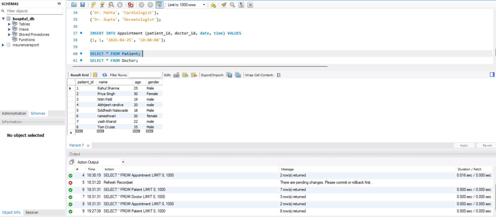
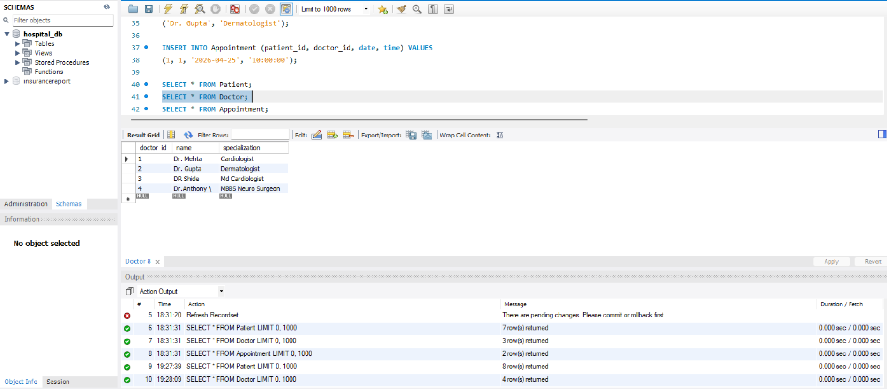
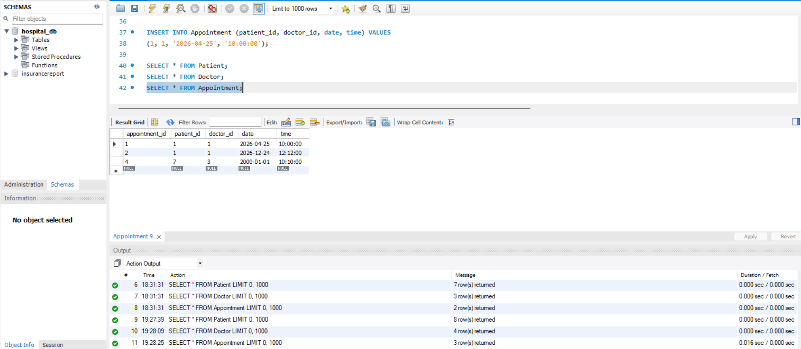

# DBMS-Hospital-Patient-Management-System
Here I have Created This Project of Dbms On Hospital Patient Management System Using MySQL With Python Connectivity And Side By Side Using Command And Prompt For Creating Users Interface  Aiming On Managing Hospital Operations 

# 🏥 Hospital Management System

## 📌 Overview

A Hospital Management System built using Python and MySQL to manage patients, doctors, and appointments efficiently.

## 🚀 Features

* Add, Update, Delete Patients
* Manage Doctor Records
* Book Appointments
* MySQL Database Integration

## 🛠️ Technologies Used

* Python
* MySQL

## ⚙️ How to Run

1. Import the database:

   ```sql
   source hospital.sql;
   ```
2. Run the application:

   ```bash
   python app.py
   ```

## 📂 Project Structure

* app.py → Main application
* db.py → Database connection
* hospital.sql → Database schema and data

## 📊 Database Output

## 💻 Application Execution (CMD)

### 🏥 Patient & Doctor Management



### 📅 Appointments & Records



## 📸 Output Screenshorts 

### 👤 Patient Records



### 🩺 Doctor Records



### 📅 Appointment Records



## 📚 Future Improvements

* GUI using Tkinter
* Web version using Flask
